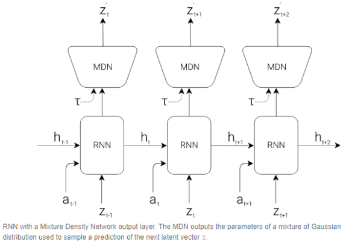

# DifferentWorldModels

## Abstract

Car-racing v0 is an exciting and difficult environment that was recently solved using a model proposed in World Models[1]. In this demo, we explore alternate versions of the model that change the type of information utilized in the agent’s internal model of the world, such as using a beta-VAE and a randomly initialized MDN-RNN and compare the results to the standard implementation as proposed in the original world models paper [2, 3]. We show that the beta-VAE has the potential to achieve better results, with a peak reward of 570.

VIDEO GOES HERE (probably): Record a 2-3 minute long video presenting your work. One option - take all your figures/example images/charts that you made for your website and put them in a slide deck, then record the video over zoom or some other recording platform (screen record using Quicktime on Mac OS works well). The video doesn't have to be particularly well produced or anything.

## Introduction

The goal of this project was to investigate the effectiveness of alternative implementations of the WorldModels model, as well as the replicability of their results. The original model is extremely exciting, as it’s based on the idea that humans have an internal model of the world around them and make decisions based on visual representations and memory of these representations. In this project, we explore the effects of changing the type of information stored in that internal model by changing the Beta value in the VAE (variational autoencoder).

We also thought it was interesting that a group randomly initialized an MDN-RNN and found it to perform just as well in learning an external environment [2]. Of course, this means that the agent will not be able to create hallucinations that visually make sense, and this is something we did not dive into. We explored these results by also using a randomly initialized MDN-RNN.

## Related Work

1. https://worldmodels.github.io/
  - This is the original model. it uses a VAE, an MDN-RNN, and a linear controller to choose actions. it achieves a state of the art performance with 950 reward, solving the environment.
2. https://ctallec.github.io/world-models/
  - This group reimplemented the original model, as well as an alternative version with a randomly initialized MDN-RNN. Their reimplementation of the model achieved 860 reward. Their reimplementation with the randomly initialized weights in the MDN-RNN achieved a score of 870.
3. https://openreview.net/references/pdf?id=Sy2fzU9gl
  - This group trains an alternative version of the standard VAE (https://arxiv.org/abs/1312.6114). When training a VAE, the loss function is made up of two terms: reconstruction loss and KL divergence. This group manipulated the loss function by multiplying the KL divergence by a value beta > 1. In doing so, they are able to change the properties of the latent vector z. The greater the beta value utilized, the more “disentangled” the z vector becomes from the original input image. After performing hyperparameter optimization with the beta value, they are able to train a VAE that achieves better reconstructions than the original (beta = 1).

## Approach

We decided to solve the problem using 4 different models. We’ll first discuss the original model, and then what adjustments we made, as well as their effects.

#### VAE
The VAE takes in the current frame (a 64 x 64 x 3 image) as input and compresses it into a latent vector, which we shall call z. This z vector can be thought of as the model’s internal representation of the world.

#### MDN-RNN
The MDN-RNN takes in the current z, the currently chosen action, and the hidden state of the previous time step. It outputs the hidden state of the next time step. It can also be used to predict the z vector of the next frame (as the original authors put it, this is part of the model’s ability to create a dream state); we did not explore this feature. The MDN-RNN essentially keeps track of the model’s history. It could theoretically be keeping track of “higher order” info such as velocity and acceleration (which transcend individual time steps), as suggested by the one of the groups that reimplemented the model[2].

#### Controller
Takes in the current z vector and the current hidden state to choose an action for the agent. The controller consisted of a linear layer whose output was fed through a Tanh function.

#### Beta-VAE
We experimented with using various beta-VAEs, which is where our model architecture differs from the original. As stated in the “Related Work” section, the Beta-VAE uses a modified loss function during training. The KL divergence term in the loss function is multiplied by a beta value greater than 1, which encourages the z vector to become a disentangled representation of the input image. The original model can be thought of as using a beta value of 1 (meaning the KL divergence term was not modified). In addition to the original beta = 1 variational autoencoder, we trained 3 more controllers using beta values equal to 2, 4, and 8.

#### Training
To train the VAEs, we took random rollouts of the environment and trained the VAE to reproduce each image in the rollout. To train the MDN-RNN, we used randomly initialized weights. To train the controller, we used the CMA-ES evolution strategy. This was the same evolution strategy used by the authors of the original paper.

## Results

We evaluated the approach by looking at the best evaluation for the model. The evaluation is determined by averaging the reward of 10 rollouts every 3 epochs, using the controller parameters from the best candidate solution of the CMA-ES. We also looked at the video to determine what issues may be present in the controller. The two most common issues we found were shaky driving and trouble with sharp turns.

Figure 1 shows the learning curves for the four different models, and Figure 2 displays the best evaluation values from the four different models. In the learning curves, we see a gradual improvement as the number of epochs increases, but it is very jumpy. This may be partly due to the fact that we limited the number of candidate solutions for CMA-ES to 4 resulting in a smaller sample to work with and, thus, less representative mean values for the following epochs. We found that a beta value of 2 results in the highest scores in this environment. 

#### Figure 1

#### Figure 2

| Beta Values      | Best Evaluation |
| :---             |    :----:       |
| 1                | 360             |
| 2                | 570             |
| 4                | 529             |
| 8                | 126             |

## Discussion

Despite the fact that we were not able to reproduce the results in the paper, we were able to implement an architecture that has all the same components, which learns useful information in the car racing environment. The key components that differentiates what we did are that we used an MDN-RNN with random weights, and we tried different visual representations for the VAE. We did not explore training with a dream since our MDN-RNN could not produce a reasonable prediction. The controller and training methods were the same as in the world models paper.

We trained the controller on google colab and found there to be memory leaks that caused us to run out of RAM. To remedy this issue, we had a script that ran 3 epochs and then saved the state of whatever was needed and then ran the script again. Initially, the results were unsatisfactory and the controller was learning at a very slow rate. Each time the script ran, it used one gym environment to train the controller. We found that using 4 different gym environments resulted in better evaluation scores. Although we did not perform quantitative analyses for this in our results, it would be something worth exploring. We speculate that varying the gym environment allows the CMA-ES algorithm to come up with more accurate reward values due to the variation that different gyms provide.

We experimented with varying beta values for the VAE, and found that our implementation with beta = 2 performed the best. This is interesting, as it suggests that this disentangled latent z vector contains better information than the z vector in the original implementation. We also found it interesting that too high of a beta value (beta = 8) leads to a network that was not able to learn very much. We hypothesize that this VAE with beta = 8 learns too much of a disentangled representation of the image, meaning that the information it encodes is not relevant to the task of action selection.

In the future, we would like to look at ways to augment the information stored in the MDN-RNN’s hidden state. If we could achieve more complex, information-rich states, it’s conceivable that we could get better performance.

Furthermore, we noticed that our agents especially struggled at very close turns or u-turns. We think it could be worthwhile training the agent from different starting points in the environment. We hypothesize that, if we were to train the agent from near a sharp turn specifically at the start as many times as we would like, it could get better at this specific task much faster than when said sharp turns are more sparsely encountered throughout a rollout.

Our work here connects to the predictive coding theory of the brain, a research area Mozes is currently working in. One of the main ideas of this theory is that the brain contains an internal model of the world that it continually updates [4]. We see our work as a proof of initial concept for the idea that enriching the information stored in the internal model (in the form of the latent vector z) can lead to better, or at least on par performance. In the future, we hope to delve deeper into this and design a model for this environment based on active inference [5].

## References

1. https://worldmodels.github.io/
2. https://ctallec.github.io/world-models/
3. https://openreview.net/references/pdf?id=Sy2fzU9gl
4. https://www.nature.com/articles/nn0199_79
5. https://link.springer.com/article/10.1007/s00422-019-00805-w#:~:text=Active%20inference%20is%20an%20approach,be%20improved%20in%20two%20ways.
